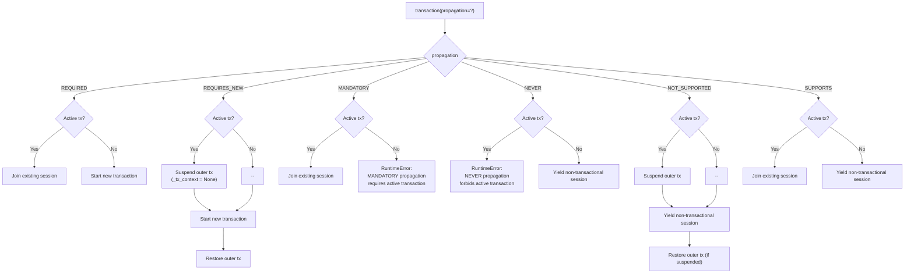
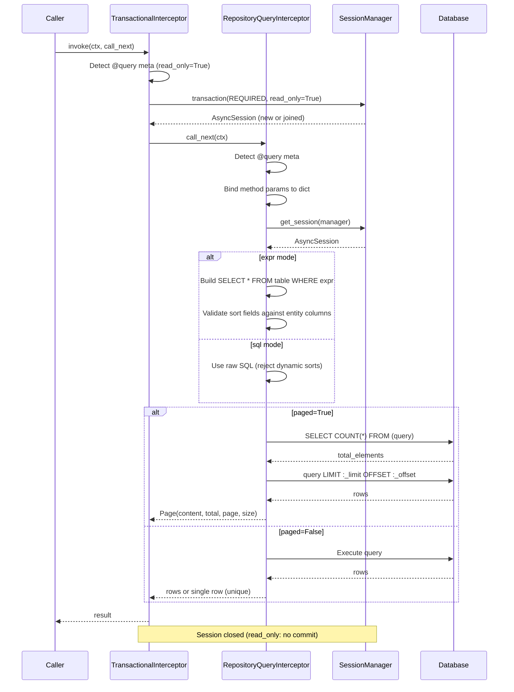
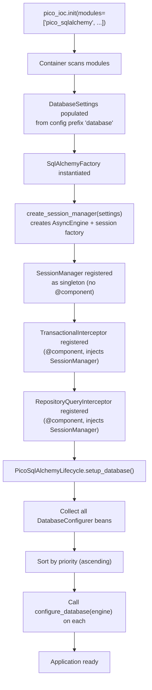

# Architecture Overview — pico-sqlalchemy

`pico-sqlalchemy` is a thin integration layer that connects **Pico-IoC**'s inversion-of-control container with **SQLAlchemy**'s async session and transaction management.
Its purpose is not to replace SQLAlchemy — but to ensure that **repositories and domain services are executed inside explicit, async-native transactional boundaries**, declared via annotations, consistently managed through Pico-IoC.

---

## 1. High-Level Design

```text
             ┌─────────────────────────────┐
             │          SQLAlchemy         │
             │ (AsyncEngine / AsyncSession)│
             └──────────────┬──────────────┘
                            │
                  Async Transaction Wrapping
                            │
             ┌──────────────▼───────────────┐
             │       pico-sqlalchemy        │
             │ @transactional  @repository  │
             │ @query          Pagination   │
             └──────────────┬───────────────┘
                            │
                     IoC Resolution
                            │
             ┌──────────────▼───────────────┐
             │           Pico-IoC           │
             │ (Container / Scopes / DI)    │
             └──────────────┬───────────────┘
                            │
               Async Domain Services, Repos,
                    Aggregates, Logic
```

---

## 2. Component Model

pico-sqlalchemy registers the following components at startup:

```text
┌─────────────────────────────────────────────────────────────────────┐
│                         Pico-IoC Container                         │
│                                                                     │
│  ┌─────────────────────────────────┐                                │
│  │ SqlAlchemyFactory               │  @factory                      │
│  │   └─ @provides(SessionManager)  │  Creates SessionManager from   │
│  │                                 │  DatabaseSettings (singleton)   │
│  └─────────────────────────────────┘                                │
│                                                                     │
│  ┌─────────────────────────────────┐                                │
│  │ PicoSqlAlchemyLifecycle         │  @component + @configure       │
│  │   └─ setup_database()           │  Runs all DatabaseConfigurers  │
│  │      collects: DatabaseConfigurer│  in priority order against     │
│  │      injects:  SessionManager   │  the engine                    │
│  └─────────────────────────────────┘                                │
│                                                                     │
│  ┌─────────────────────────────────┐                                │
│  │ TransactionalInterceptor        │  @component (MethodInterceptor)│
│  │   injects: SessionManager       │  Opens/joins transactions for  │
│  │                                 │  @transactional, @repository,  │
│  │                                 │  @query methods                │
│  └─────────────────────────────────┘                                │
│                                                                     │
│  ┌─────────────────────────────────┐                                │
│  │ RepositoryQueryInterceptor      │  @component (MethodInterceptor)│
│  │   injects: SessionManager       │  Executes SQL/expr queries     │
│  │                                 │  for @query methods only       │
│  └─────────────────────────────────┘                                │
│                                                                     │
│  ┌─────────────────────────────────┐                                │
│  │ DatabaseSettings                │  @configured (prefix="database")│
│  │   url, echo, pool_size, ...     │  Loaded from config sources    │
│  └─────────────────────────────────┘                                │
│                                                                     │
│  ┌─────────────────────────────────┐                                │
│  │ AppBase                         │  @component (singleton)        │
│  │   subclasses: DeclarativeBase   │  Central ORM model registry    │
│  └─────────────────────────────────┘                                │
│                                                                     │
│  ┌─────────────────────────────────┐                                │
│  │ SessionManager                  │  Created by factory (singleton)│
│  │   owns: AsyncEngine             │  NOT @component — no decorator │
│  │   owns: session factory         │  on the class itself           │
│  └─────────────────────────────────┘                                │
└─────────────────────────────────────────────────────────────────────┘
```

**Key detail:** `SessionManager` has **no** `@component` decorator. It is created by `SqlAlchemyFactory` via `@provides(SessionManager, scope="singleton")`. This is intentional — the factory controls its construction from `DatabaseSettings`.

---

## 3. Startup Sequence

```text
1. Container scans modules
       │
2. DatabaseSettings loaded from configuration (prefix="database")
       │
3. SqlAlchemyFactory.create_session_manager(settings) → SessionManager
       │  Creates AsyncEngine + session factory
       │
4. PicoSqlAlchemyLifecycle.setup_database(session_manager, configurers)
       │  Collects all DatabaseConfigurer implementations
       │  Sorts by priority (ascending)
       │  Calls configure_database(engine) on each
       │
5. Application ready — interceptors, repositories, services available
```

---

## 4. Transaction Context (`_tx_context`)

pico-sqlalchemy uses a `ContextVar` to propagate the active session across async call chains:

```text
_tx_context: ContextVar[TransactionContext | None]
```

This is **separate from pico-ioc's scope system**. It is a lightweight, per-async-task variable that stores the currently active `AsyncSession` wrapped in a `TransactionContext`.

**How it works:**

```text
Service.create_user()                     ← @transactional
│
│  _tx_context = TransactionContext(session_A)
│
├─ Repository.find_by_name()              ← @repository (REQUIRED)
│  │  _tx_context.get() → session_A       ← Joins existing
│  │  (no new session created)
│  └─ returns result
│
├─ Repository.save()                      ← @repository (REQUIRED)
│  │  _tx_context.get() → session_A       ← Same session
│  └─ session_A.add(user)
│
└─ commit(session_A) or rollback
   _tx_context = None
```

**Why not pico-ioc scopes?** The `_tx_context` ContextVar provides transaction propagation semantics (REQUIRED, REQUIRES_NEW, etc.) that don't map to pico-ioc's scope lifecycle. A transaction may be suspended and restored (REQUIRES_NEW, NOT_SUPPORTED), which requires explicit save/restore of the context — something ContextVar handles naturally.

---

## 5. Interceptor Chain

pico-sqlalchemy uses **two interceptors** that work together via pico-ioc's AOP system:

### For `@repository` methods (implicit transactions)

```text
method call → TransactionalInterceptor → original method body
                    │
                    ├─ Opens REQUIRED Read-Write transaction
                    └─ method body executes with session available
```

### For `@query` methods (declarative queries)

```text
method call → TransactionalInterceptor → RepositoryQueryInterceptor
                    │                           │
                    ├─ Opens REQUIRED            ├─ Binds method params
                    │  Read-Only transaction     ├─ Builds SQL (expr or raw)
                    │                            ├─ Executes query
                    │                            ├─ Handles pagination
                    │                            └─ Returns mapped result
                    │
                    └─ method body is NEVER executed
```

The `@query` decorator chains both interceptors via `@intercepted_by`:

```python
# Inside @query decorator (simplified)
step_1 = intercepted_by(TransactionalInterceptor)(func)   # Transaction layer
step_2 = intercepted_by(RepositoryQueryInterceptor)(step_1) # Query execution
```

### Configuration priority

When multiple decorators apply to the same method, `TransactionalInterceptor` resolves the transaction configuration using this priority:

| Priority | Source | Default Behavior |
| :--- | :--- | :--- |
| **1 (Highest)** | `@transactional` metadata | User-defined (explicit) |
| **2** | `@query` metadata | `read_only=True` |
| **3 (Lowest)** | `@repository` metadata | `read_only=False` |

---

## 6. Transaction Propagation Model

Supported propagation levels (modeled after Spring Data):

| Propagation | Behavior |
| :--- | :--- |
| `REQUIRED` | Join existing or start new (default) |
| `REQUIRES_NEW` | Suspend current, always start new |
| `SUPPORTS` | Join if exists, else run without transaction |
| `MANDATORY` | Must already be in a transaction |
| `NOT_SUPPORTED` | Suspend any transaction, run non-transactional |
| `NEVER` | Error if a transaction is active |

**Suspension mechanism:** `REQUIRES_NEW` and `NOT_SUPPORTED` save the current `_tx_context`, set it to `None`, execute in a new context, then restore the original. This ensures the outer transaction is unaffected.

```text
REQUIRES_NEW flow:
  _tx_context = ctx_A (outer)
  │
  ├─ save ctx_A, set _tx_context = None
  ├─ create new session_B, _tx_context = ctx_B
  ├─ execute method with session_B
  ├─ commit/rollback session_B
  └─ restore _tx_context = ctx_A
```

Session lifecycle is fully deterministic:

```text
begin → await work → await commit or await rollback → await close
```

Rollback logic is selective via:
- `rollback_for=(...)` — exception types that trigger rollback (default: `Exception`)
- `no_rollback_for=(...)` — exception types that skip rollback

---

## 7. Query Execution Model

The `RepositoryQueryInterceptor` supports two execution modes:

### Expression mode (`@query(expr="...")`)

Requires `@repository(entity=Model)`. Generates SQL automatically.

```text
@query(expr="username = :username", unique=True)
                │
                ▼
SELECT * FROM users WHERE username = :username
                │
                ├─ Parameters bound from method signature
                ├─ Dynamic sorting appended (if PageRequest with sorts)
                │  └─ Column names validated against entity.__table__.columns
                └─ unique=True → scalars().first() | default → scalars().all()
```

### SQL mode (`@query(sql="...")`)

Full control over the query. Does **not** require entity binding.

```text
@query(sql="SELECT u.name, count(p.id) FROM users u JOIN posts p ...")
                │
                ├─ Parameters bound from method signature
                ├─ Dynamic sorting NOT supported (ValueError if attempted)
                │  └─ Security: prevents injection in raw SQL
                └─ Returns dict-like mappings (RowMapping)
```

### Pagination flow (`@query(..., paged=True)`)

```text
@query(expr="active = true", paged=True)
async def find_active(self, page: PageRequest) → Page[User]:
                │
                ▼
1. Extract PageRequest from parameter named "page" (required name)
2. Build base SQL (expr or raw)
3. Execute COUNT(*) subquery → total_elements
4. Append LIMIT :_limit OFFSET :_offset
5. Execute paginated query → content rows
6. Return Page(content, total_elements, page, size)
```

`Page[T]` provides computed properties: `total_pages`, `is_first`, `is_last`.

---

## 8. Repository Model

Repositories are **plain Python classes** declared with `@repository`. They:

- Receive dependencies via `__init__` (constructor injection)
- Run all public async methods inside transactional boundaries (implicit Read-Write)
- Access the active async session using `get_session(manager)`

```python
@repository(entity=User)
class UserRepository:
    def __init__(self, manager: SessionManager):
        self.manager = manager

    # Implicit Read-Write transaction (from @repository)
    async def save(self, user: User) -> User:
        session = get_session(self.manager)
        session.add(user)
        return user

    # Declarative Read-Only query (from @query)
    @query(expr="username = :username", unique=True)
    async def find_by_username(self, username: str) -> User | None:
        ...  # Body is never executed
```

No transactional code inside the repository. No global sessions. No shared state.

---

## 9. Scoping Model

`pico-sqlalchemy` does **not** introduce custom IoC scopes. Instead, it relies on transaction boundaries:

| Scope | Meaning |
| :--- | :--- |
| Transaction (via `_tx_context`) | `AsyncSession` lifetime, per-async-task |
| Singleton | `SessionManager`, `AppBase`, interceptors, factories |
| Request-specific (optional) | Available if combined with `pico-fastapi` |

Unlike `pico-fastapi`, there is no middleware layer. The container and interceptors drive the entire lifecycle.

---

## 10. Architectural Intent

**pico-sqlalchemy exists to:**

- Provide declarative, Spring-style **async** transaction management for Python
- Replace ad-hoc `async with session...` scattered across repositories
- Centralize `AsyncSession` creation and lifecycle in a single place
- Make transactional semantics explicit and testable
- Ensure business logic is clean and free from persistence boilerplate

It does *not* attempt to:

- Replace SQLAlchemy Async ORM or `AsyncEngine`
- Change SQLAlchemy's session model
- Hide transaction boundaries
- Validate or transform query results (that is Pydantic's job)

---

## 11. When to Use

Use `pico-sqlalchemy` if:

- Your application uses the SQLAlchemy Async ORM
- You want clean repository/service layers
- You prefer declarative transactions and queries
- You want deterministic `AsyncSession` lifecycle
- You value testability and DI patterns

Avoid `pico-sqlalchemy` if:

- You are not using `asyncio` or the SQLAlchemy async extensions
- You prefer manual session management
- You only use SQLAlchemy Core with no ORM session lifecycle

---

## 12. Diagrams (Mermaid)

### Transaction Propagation Decision Flow



### Interceptor Chain for `@query`



### Startup Sequence


